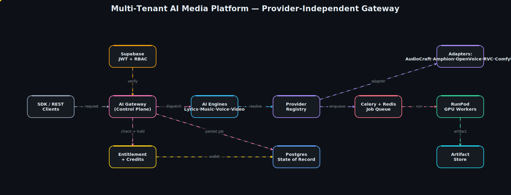

# Multi-Tenant AI Media Platform

**A provider-independent AI Gateway for Lyrics, Music, Voice and Video generation** —
white-label ready, multi-tenant, and built so business logic never depends on any
single AI provider.



> 📽️ A matching animated GIF is in `assets/architecture.gif` (handy for slides & proposals).

---

## Overview

This is a **starter architecture** for an enterprise-grade AI SaaS platform that turns a
prompt into music, a voice, a set of lyrics, or a video — while staying completely
**provider-agnostic**. Open-source models (AudioCraft, Amphion, OpenVoice, RVC, ComfyUI)
run on **RunPod Serverless GPU workers**, but the platform's core never imports them
directly: every model sits behind an **Adapter**, and callers resolve one through a
**registry** by *capability*, not by name.

The design cleanly separates two planes:

- **Control Plane** — FastAPI: authentication, tenancy, feature entitlements, the
  credits/wallet ledger, job bookkeeping, and dispatch. Stateful, transactional, fast.
- **AI Plane** — engines + provider adapters + GPU workers. Stateless, horizontally
  scalable, swappable.

That split is what makes the platform **model-agnostic, white-label-ready, and
enterprise-safe**: you can add a provider, retire another, or resell the whole stack
under a tenant's brand without touching business logic.

## Architecture walkthrough

Data flows left → right along the diagram:

1. **SDK / REST clients** call a single `POST /v1/generate` endpoint with a `modality`.
2. **Supabase (JWT + RBAC)** — the bearer token is verified locally and projected onto a
   `TenantContext` (org, user, role, plan). Multi-tenancy is enforced by construction.
3. **AI Gateway (Control Plane)** orchestrates the request: entitlement → provider
   resolution → credit hold → persist → enqueue.
4. **Entitlement + Credits** — the tenant's subscription plan gates which modalities are
   allowed; the **credits engine** quotes a cost (base price × provider `cost_weight`) and
   places a **hold** on the wallet *before* any GPU time is spent.
5. **AI Engines** (Lyrics · Music · Voice · Video) own modality-specific pre/post
   processing and delegate raw inference downstream.
6. **Provider Registry** resolves a concrete **Adapter** by capability — honoring an
   optional pin, otherwise picking the cheapest capable provider.
7. **Celery + Redis** queue the job; a worker **dispatches to RunPod GPU workers**.
8. **RunPod GPU workers** run the model and write the output to the **Artifact Store**
   (S3-compatible / Supabase Storage), returned as a signed URL.
9. On completion the worker **settles** the credit hold (refunding any over-estimate);
   on failure it **fully refunds** — clients never pay for a job that produced nothing.
10. **Postgres** is the state of record for tenants, wallets, jobs and entitlements.

## Tech stack

| Layer            | Technology                                                        |
| ---------------- | ----------------------------------------------------------------- |
| API / Gateway    | Python 3.11, FastAPI, Pydantic v2                                 |
| Async / Queue    | Celery, Redis                                                     |
| Datastore        | PostgreSQL (SQLAlchemy 2.x)                                       |
| Auth             | Self-hosted Supabase — JWT verification + RBAC                    |
| GPU compute      | RunPod Serverless (per-provider endpoints)                       |
| AI providers     | AudioCraft · Amphion · OpenVoice · RVC · ComfyUI *(adapter stubs)*|
| Packaging / Infra| Docker, Docker Compose, Makefile                                 |

## Project structure

```
src/aiplatform/
├── main.py               # FastAPI app factory + error mapping
├── config.py             # Typed settings (env / .env)
├── api/
│   ├── deps.py           # Composition root: DI + tenant resolution
│   └── routers/          # generate · jobs · wallet · health
├── core/                 # security (JWT/RBAC), tenancy guard, errors
├── domain/               # provider-agnostic models + plan catalog
├── providers/            # ADAPTER LAYER — base, registry, 5 provider stubs
├── engines/              # AI Plane: lyrics · music · voice · video
├── services/             # Control Plane: gateway · credits · entitlements
├── repositories/         # Repository interfaces + in-memory backends
├── infra/                # connector stubs: db · redis · supabase · runpod
└── workers/              # Celery app + generation task (settle/refund)
tests/                    # credits math · registry routing · entitlement gating
assets/                   # architecture.json + animated svg/gif
```

Clean architecture throughout: **Routers → Services → Repositories**, with `providers/`
(adapters) and `engines/` (AI Plane) as first-class, independently swappable seams.

## Getting started

**Prerequisites:** Python 3.11+, and (for the full topology) Docker + Docker Compose.

```bash
# 1. Configure
cp .env.example .env          # fill in Supabase / RunPod / DB values

# 2a. Run everything (API + worker + Postgres + Redis)
make up                       # docker compose up --build

# 2b. …or run the API locally against your own Redis/Postgres
make install                  # pip install -e ".[dev]"
make run                      # uvicorn on :8080  → http://localhost:8080/docs
make worker                   # Celery worker in a second shell
```

The interactive OpenAPI docs at `/docs` expose `POST /v1/generate`, `GET /v1/jobs/{id}`,
and `GET /v1/wallet`. In-memory repositories are seeded so the endpoints are exercisable
before you wire real Postgres.

## Testing

```bash
make test        # pytest -q   → credits, provider registry, entitlement gating
make lint        # ruff check
```

The suite proves the wiring end-to-end on stubs: credit hold/settle/refund math,
model-agnostic provider resolution (cheapest-first + honored pins), and the gateway
gating unentitled modalities *before* any credits are spent or jobs enqueued.

## Roadmap — what a full build adds

This skeleton is intentionally minimal but coherent. A production build layers on:

- **Real provider adapters** — actual RunPod worker images for each model, with `/run` +
  `/status` polling and streaming progress for long video jobs.
- **SQLAlchemy repositories** behind the existing `Protocol`s (drop-in for the in-memory
  backends), plus Alembic migrations.
- **Billing** — Stripe metered usage, credit top-ups, monthly grant reset, invoicing.
- **White-label** — per-tenant plan catalogs, branding, custom domains, isolated storage.
- **Developer platform** — API keys, scoped tokens, rate limits, webhooks, generated SDKs.
- **Observability** — structured logs, OpenTelemetry traces across the async plane,
  per-provider latency/cost dashboards, and autoscaling GPU pools.

---

*Starter architecture by **Arpit Singh** — Senior AI & Data Engineer.*
